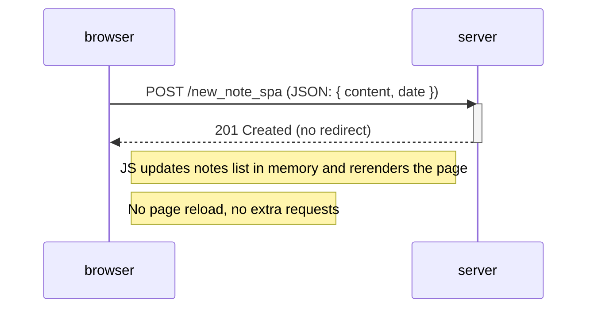

```mermaid
sequenceDiagram
    participant browser
    participant server

    browser->>server: POST /new_note_spa (JSON: { content, date })
    activate server
    server-->>browser: 201 Created (no redirect)
    deactivate server

    Note right of browser: JS updates notes list in memory and rerenders the page
    Note right of browser: No page reload, no extra requests
```